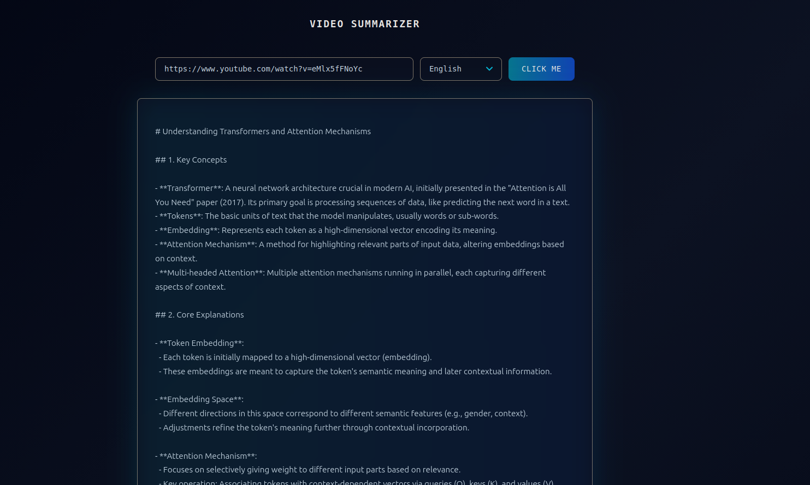

# Video Summarizer Overview
This is my first attempt at building a complete end-to-end application using a FastAPI backend, an OpenRouter LLM integration, and a React frontend. The backend and frontend run as separate modules.

## Purpose
The goal is to generate structured note-style summaries of YouTube videos. Academic or concept-heavy videos often contain dense explanations that are hard to follow in real time (at least for me). This app provides a baseline set of notes and a quick way to evaluate whether a video is worth watching.

---

# Backend (`app/main.py`)

- Backend entry point.  
- Fully permissive CORS so the React frontend can call the API locally.  
- Incoming payload contains:
  - A YouTube URL or raw video ID  
  - A language code (`en` or `fr`)
- Extracts the 11-character YouTube video ID.  
- Retrieves the transcript using `youtube-transcript-api` inside a background thread.  
- Concatenates all transcript segments into one block.  
- Sends that text to OpenRouter with an async POST call and returns the generated summary.  
- Provides `/` and `/health` for basic checks.  
- Includes the uvicorn launcher for direct execution.  
- Requires a `.env` file inside `app`:

OPENROUTER_KEY=<your key>

---

# Frontend (`reactlab/src/App.jsx`)

- Captures a YouTube URL/ID and a language selection.  
- Builds the request URL using `import.meta.env.VITE_API_URL`.  
- Sends a POST request to `/generate_summary` with `{ id, lang }`.  
- Renders an error message, a loading state, or the summary text depending on backend output.  
- Uses `App.css` for styling.

### Frontend Environment
A `.env` file inside `reactlab` must define the backend URL:

VITE_API_URL=http://localhost:8000

This allows the React frontend to reach the FastAPI `generate_summary` endpoint during local development.

